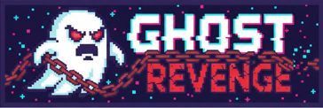
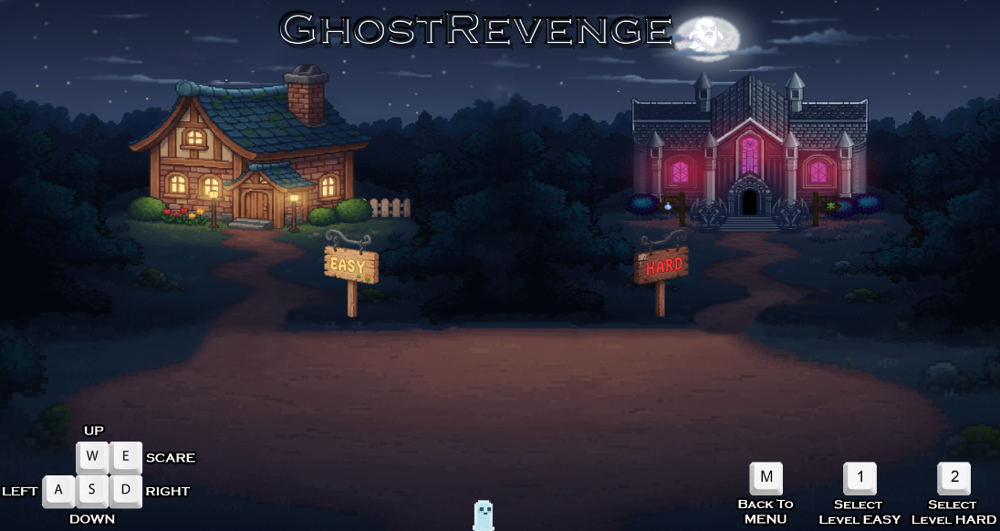
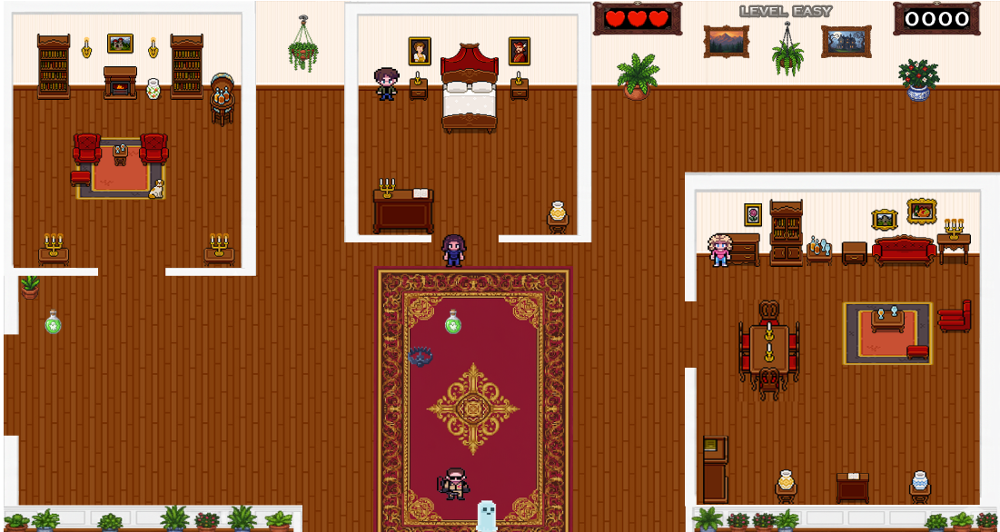
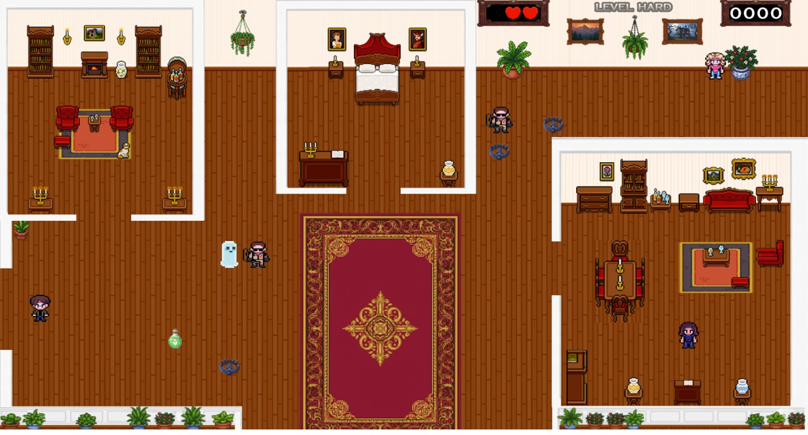
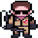
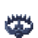

    

## 📖 Historia

Despojado de tu hogar y harto de vivir en las calles, decidís que es tiempo de recuperar tu casa de una vez por todas. Para eso, es necesario echar a los nuevos dueños. Sin embargo, tu misión no será fácil. Los vecinos ya advirtieron a los dueños sobre vos, así que contrataron a los mejores y más expertos cazadores de fantasmas de la ciudad.

**Tu misión:** Asustarlos a todos y evitar ser cazado. Contás con solo **tres vidas** antes de ser enviado totalmente a la tierra de los muertos y quedar como un perdedor ante los demás fantasmas.

### 👻 Dinámica de Juego
> 🧱 **A tener en cuenta:** Aunque sos un espectro, tu energía aún es inestable en el mundo físico. Por eso, **ni vos ni los cazadores pueden atravesar las paredes**. Deberás usar los pasillos y habitaciones estratégicamente para emboscar o huir.

---

## 📸 Capturas Del Juego

  
  
  

---
## 🎮 Controles
| Tecla | Acción |
| :---: | :--- |
| **W / A / S / D** | Moverse por la casa (Arriba, Izquierda, Abajo, Derecha) |
| **E** | **¡Asustar!** |
| **M** | Volver al Menú Principal |
| **1 / 2** | Elegir Nivel |

---

## Personajes y Enemigos

### ** Grimly (Tú)**
El protagonista fantasmal.
* **Objetivo:** Asustar a todas las personas para pasar de nivel.
* **Salud:** 3 Corazones ❤️❤️❤️.

### ** Cazadores**
Expertos contratados por los dueños.
* **Comportamiento:** Te persiguen si te ven.
* **Consecuencia:** Si te atrapan, perdés **1 corazón** y **puntos**.

### ** Personas (NPCs)**
Los nuevos inquilinos molestos.
* **Objetivo:** Debes asustarlos a todos.
* **Recompensa:** Otorgan puntos al ser asustados.

---

## Items y Trampas

| Objeto | Efecto |
| :--- | :--- |
| **Poción** | Regenera **1 corazón** perdido y otorga puntos extra. |
| **Trampa** | Te resta **Puntos**, **1 corazón** y te devuelve a tu posición inicial. |

---

## 💻 Requisitos del Sistema

Este proyecto fue desarrollado y probado bajo el siguiente entorno:

* **Wollok:** v1.0.2
* **Node.js:** v22.19.0
* **NPM:** v11.6.2

> ⚠️ **Nota:** Se recomienda utilizar estas versiones (o superiores) para garantizar la compatibilidad del juego.

---

 ## Equipo de desarrollo

- Gabriel Michel
- Aldana Quadrini
- Abril Rocio Lara

---

- *Proyecto realizado para la materia Programación con Objetos 1 - Comision 4, 2025 - Universidad Nacional de Hurlingham*
- *Una vez terminado, no tenemos problemas en que el repositorio sea público*
